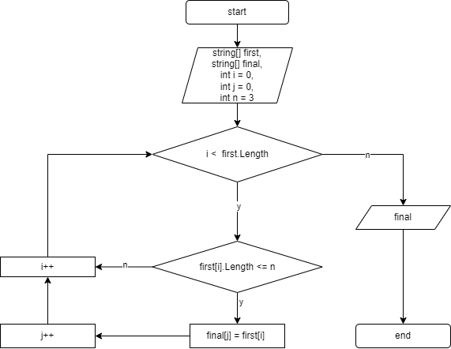

# FinalHWGB

## Задача:
Написать программу, которая из имеющегося массива строк формирует массив из строк, длина которых меньше либо равна 3 символа. Первоначальный массив можно ввести с клавиатуры, либо задать на старте выполнения алгоритма. При решении не рекомендуется пользоваться коллекциями, лучше обойтись исключительно массивами.

### Решение решения:
1. Пробегаем по рервому массива
2. Проверяем значения из массива на соответствие условию: _длина которых меньше либо равна 3 символа_
3. Если строка удовлетворяет условию записываем значение в новый массив
4. Повторяем пункты 2 и 3 пока не пробежим по первому массиву
5. Выводим финальный массив как результат

### Блок-схема алгоритма:

